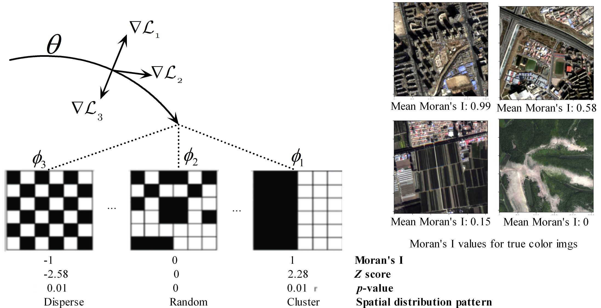

```{r setup, include=FALSE}
knitr::opts_chunk$set(echo = TRUE)
knitr::opts_chunk$set(eval = FALSE)
```



This code library is shared for the project paper titled *Spatial Sampling to Enhance Meta-Learning for Semantic Segmentation of Build-Ups in Remote Sensing*. Data samples for this project can be generated through the sampling program, which utilizes the source GID dataset available for download at https://captain-whu.github.io/GID. 

The model process includes four steps: 

* **Patch sampling**: Original satellite images formed the basis for patch sampling.

* **Moran's I extraction**: Multiscale convolution operators extracted pixel-level Moran's I, and the mean Moran's I at the patch level is computed.

* **Sample selection**: Quantiles of summarized Moran's I were used for grouping and sample selection, leading to the division of training, validation, and testing samples.

* **Meta-learning architectures** The MAML meta-learning architecture for UNet was developed and tested on the GID dataset. Spatial samples grouped by Moran's I were used for training, validation, and testing in meta-learning. 

* **Transfer learning**: Transfer learning was executed for pretrained SegFormer, Swin-UNet, and meta UNet.

* **Statistical analysis**: Experiments from steps 5 and 6 were repeated at least 5 times, and their mean performance was summarized.  

* **Image predictions**: Predictions for original large images were generated using various methods, including vanilla UNet, meta UNet, and pretrained SegFormers. 

## 1. Patch Sampling

To execute patch sampling, utilize the python script "patchsam_gid5.py". This script allows you to customize the patch size and border length for the sampling process. Additionally, the oversampling step for patch sampling can be configured in the code file "datagid5/sampling_complexity_testall.py" (config dict: samdsetsConfig). Ensure that you specify the target path to store the patch sample data and provide the source paths for GID images and labels within the code file.

Before employing the patch sampling program, it is essential to download the GID dataset from the following web address: https://captain-whu.github.io/GID.

```{python}
python patchsam_gid5.py 
```

## 2. Moran's I Extraction
Refer to the "Comp2dConv" class in "gcomplex/com2cov.py," as it contains the core code for the Moran's I convolution operator. In this class, you have the flexibility to configure multiple kernel sizes for extracting multiscale Moran's I (default sizes: mkernel_sz=[21,15,11,7,5]) directly within the code file.

Furthermore, the calculation of multiscale Moran's I for all land cover classes is conducted, and you can customize the specific land cover classes for Moran's I extraction. To achieve this, simply modify the dictionary in the "morani_gid5_mscale.py" code file. For instance:

```{python}
clsssDict1={0:'background',1:'water',2:'buildup',3:'farmland',4:'forest', 5:'meadow'}.
```

By revising this dictionary, you can specify the target land cover classes for Moran's I extraction according to your requirements.

```{python}
python morani_gid5_mscale.py 
```

## 3. Sample selection 
This step involves the patch-level summarization of Moran's I for all patch samples, facilitated by the parallel code found in "morani_gid5_mscale_sum.py."

To initiate parallel summarization, commence by executing the provided shell script:

```{bash}
./morani_gid5_mscale_sum.sh 
```

Following this, invoke the R script to consolidate all generated files into a comprehensive summary file:

```{bash}
Rscript morani_gid5_mscale_sum_agg.R  
```

For streamlined integration of sample selection into both training and testing, leverage the functionality available in the "sampling/sampling.py" program. Make certain to set up the input and output paths appropriately before invoking the program. 

## 4. Meta-learning Architectures
The organization of data and task sampling for meta-learning is orchestrated through the "metadataload.py" program. Data sample splits are determined based on Moran's I mean, considering their distinct spatial distribution patterns.

The MAML-based meta-learning framework is predominantly implemented in the "memaseg.py" code, featuring a set of configurable parameters essential for its execution. These parameters include:

```{python}
    --batch-size=<int>                      Preset batchsize [default: 6]
    --learn-inner-lrs                       whether to learn the inner learning rate
    --gpu=<int>                             use indexed GPU [default: 0]
    --seed=<int>                            seed [default: 0]
    --num-group=<int>                       number of way (groups) [default: 1]
    --num-support=<int>                     number of support samples [default: 4]
    --num-query=<int>                       number of query samples [default: 4]
    --num-workers=<int>                     worker number [default: 3]
    --num-inner-steps=<int>                 number of inner iterations [default: 1]
    --init-inner-lr=<float>                 initial inner learning rate [default: 0.2]
    --outer-lr=<float>                      outer learning rate [default: 0.01]
    --log-interval=<int>                    interval number [default: 2]
    --val-interval=<int>                    val internal number [default: 2]
    --save-interval=<int>                   save interval number [default: 100]
    --num-test-tasks=<int>                  number of test tasks [default: 50]
    --num-train-iterations=<int>            iteration number [default: 1000]
    --checkpoint-step=<int>                 checkpoint step [default: 10]
    --iloop-batch=<int>                     innerloop batch [default: -1]
    --oloop-batch=<int>                     outer loop batch [default: -1]
    --num-outer-steps=<int>                 outer loop step [default: 1]
    --checkpoint-step=<int>                 checkpoint step [default: -1]
    --log-dir=<str>                         path to save the results [default: /geosampling]
```

A typical implementation resembles the following: 

```{python}
python memaseg.py --learn-inner-lrs --gpu 0 --batch-size 4 --num-group 1 --num-support 5  --num-query 5  --num-inner-steps 1   --init-inner-lr 0.4 --outer-lr 0.03 --num-train-iterations 2 --iloop-batch 10  --oloop-batch 10  --log-dir /tmp/test1 
```

## 5. Transfer Learning 
For effective transfer learning, it is essential to configure the data and output paths, select the pretrained model, and set other necessary parameters. The transfer learning process is implemented in the "finetune_transfer_gid5.py" program, which includes the following configurable parameters: 

```{python}
    --gpu=<int>                             use indexed GPU, -1 means no GPU [default: 0]
    --seed=<int>                            seed [default: 0]
    --batch-size=<int>                      batch size [default: 12]
    --train-prp=<float>                     train sample proportion [default: 0.1]
    --test-prp=<float>                      test sample proportion [default: 0.2]
    --testsample-type=<str>                 test sample type [default: random]
    --n-epoch=<int>                         epoch number [default: 2]
    --stratify=<str>                        stratification factor [default:None]
    --stratify-rng=<int or list>            stratifum number [default: 5]
    --weight=<str>                          weight factor [default:None]
    --model-type=<str>                      model type [default: unet]
    --loss-weight=<str>                     weight field for loss function [default:None]
    --con-opt=<str>                         constrained optimization [default:None]
    --con-opt-w=<tuple<float>>              weights for BCE and constrained optimization [default:None]
    --target-class=<str>                    classification [default: buildup]
    --log-dir=<str>                         path to save the results [default: /geosampling/rs_gidcls5/meta_swin_log]
    --pretrain-mode=<str>                   pretrain mode [default: all]
```

A typical implementation, using the pretrained meta UNet, looks like this:

```{python}
python finetune_transfer_gid5.py --gpu 0 --model-type meta_train --train-prp 0.1 --pretrain-mode all --n-epoch 2 --log-dir /geosampling/meta_train
```

## 6. Statistical analysis
Following the training and testing of all models, a comprehensive statistical analysis is conducted to compare their test performance. To facilitate this analysis, you can utilize the "comparedmodels.R" script, and this script compares the learning curves of the models. You may also need to calculates their mean, standard deviation, performs t-tests, and generates 95% confidence intervals. The following code snippet is specifically designed for comparing the learning curves:

```{bash}
Rscript comparedmodels.R 
```

## 7. Image predictions 
Once all the models have undergone finetuning and training, you can employ these models to generate predictions for image samples. The program "finetunedmodel_predict.py" has been specifically designed for this task.

```{python}
python finetunedmodel_predict.py  
```

